<!-- <script type="text/javascript" src="http://cdn.mathjax.org/mathjax/latest/MathJax.js?config=TeX-AMS-MML_HTMLorMML"></script>
<script type="text/x-mathjax-config">
    MathJax.Hub.Config({ tex2jax: {inlineMath: [['$', '$']]}, messageStyle: "none" });
</script> -->

# Project Design
In the 21st century, although people's pace of life has accelerated, they have long been accustomed to modern life, and we even write more English than Chinese characters in our daily life, but we still have to remember that the traditional culture of the Chinese nation is broad and profound, with a long history.   
In today's era, college students may click on a hundred words and memorize words every day, but they may not have read poetry as a traditional culture for months. Based on this, we developed this website called "Seeking Poetry", which means to find wonderful chapters in ancient poetry to present a colorful ancient poetry culture.

# Data and Crawler
## Crawler  
### Data to scrapy
&emsp;&emsp;The data source of our project is [shiwens.com](shiwen.com). We've got 341793 poems, 50000 verses and 11873 poets totally.

The data we want include:  
- The information of a poet, contains avatar, brief imfomation, detail imfomation, dynasty and poems link.
- The imfomation of poems for all the poets, contains author, authorid, poem content, poem name, dynasty, fanyi, shangxi, tags.

&emsp;&emsp;The content looks like this:  
```json
//poet imfomation
  "2": {
    "avatar_link": "None",
    "brief_intro": "　　刘坦（？─？），字号、籍贯不详。后周世宗显德五年（958）戊午科状元。曾为淮扬李重进书记,嗜酒。李曾经命令酒库管理人员：只要刘坦有客，无论需要多少酒，一律供给。没想到管酒库的官吏非常吝啬，每次领酒都很难。刘坦一气之下，大书一绝于官厅墙上。",  
    "detail_info": "None",
    "dynasty": "五代",
    "name": "刘坦",
    "poetlink": "https://shiwens.com/author_3357.html",
    "poetry_link": "https://shiwens.com/shis_3357.html"
  },
```
```json
// poetry links
  "1": {
    "authorid": 86,
    "name": "分题蕃宣楼送山佥宪之闽",
    "poetrylink": "https://shiwens.com/detail_332351.html"
  },
  "2": {
    "authorid": 86,
    "name": "观南阳高武宣王诰词其子浑璞治书徵赋",
    "poetrylink": "https://shiwens.com/detail_332350.html"
  },
  "3": {
    "authorid": 86,
    "name": "次韵王继学参政胡古鱼编修剪灯诗",
    "poetrylink": "https://shiwens.com/detail_332349.html"
  },
```

```json
// all poems imfomation
  "1": {
    "author": "吴师道",
    "authorid": 86,
    "content": [
      "大府开闽土，危楼镇海涯。飞云浮画栋，丽日照高牙。",
      "昔驻蕃侯马，今迎使者车。三山归指顾，万井仰光华。",
      "缥缈临城处，逍遥散吏衙。榕阴千树翠，荔子半空霞。",
      "岭峤俱清谧，宾僚亦静嘉。宣风问民俗，作屏捍皇家。",
      "去去青冥樾，依依紫禁花。登高应有赋，留待碧窗纱。"
    ],
    "dynasty": "元代",
    "fanyi": "None",
    "name": "分题蕃宣楼送山佥宪之闽",
    "poetrylink": "https://shiwens.com/detail_332351.html",
    "shangxi": "None",
    "tags": "None"
  },
```

### Asynchronous (Multi-processing) Crawler
&emsp;&emsp;The data size is so lager that the network I/O takes up most of the time. So we use `asyncio` and `aiohttp` moudle to make requests and implement asynchronous crawler. The final time cost on scrapy is two hours, efficiency has achieved a leap!

### Crawler Process
#### Scrapy Poet 
&emsp;&emsp;Firstly, we scrapy the links of detail information for all poet through `https://shiwens.com/authors_{}.html?cd={}`. 
```python
# scrapy the link of detail information for all poet
async def get_poet_link(dynasty, page):
    global poet_dic, id, headers
    async with semaphore:
        for i in range(1,page+1):
            async with session.get("https://shiwens.com/authors_{}.html?cd={}".format(str(i),dynasty),headers=headers) as response:
                response.encoding = 'utf-8'
                text = await response.text()
                tree = etree.HTML(text)
                poet_link_list = tree.xpath('//div[@class="sonspic"]/div[1]/p[1]/a[1]/@href')
                poet_list = tree.xpath('//div[@class="sonspic"]/div[1]/p[1]/a[1]/b/text()')
                for i in range(len(poet_list)):
                    poet_dic[id] = {"name":poet_list[i], "poetlink":origin_link+poet_link_list[i], "dynasty":dynasty}
                    id+=1
```
&emsp;&emsp;Secondly, make request for the poet links and scrapy the data we need. If the length of the detail imfomation is so large, we need to make `ajax` request.
```python
# get ajax information
def get_per_info(info_link):
    response_info = requests.get("https://shiwens.com/ziliao/ajax_content.html?id={}".format(info_link[5:]), headers = headers)
    response_info.encoding = 'utf-8'
    tree_info = etree.HTML(response_info.text)
    info_title_list = tree_info.xpath('//h2/span/text()')
    info_content = tree_info.xpath('//div[@class="contyishang"]/p//text() | //div[@class="contyishang"]/text()')
    info_content = [info  for info in info_content if info!=[]]
    return info_title_list[0], info_content

# scrapy the detail information of per poet
async def get_info(poetid):
    global poet_dic, id, headers
    print("开始爬取{}！".format(poet_dic[poetid]["name"]))
    async with semaphore:
        async with session.get(poet_dic[poetid]["poetlink"],headers=headers) as response:
            response.encoding = 'utf-8'
            text = await response.text()
            tree = etree.HTML(text)

            # scrapy the avatar of poet
            try:
                poet_avatar_link = tree.xpath('//div[@class="sonspic"]/div[1]/div[1]/img/@src')
                poet_dic[poetid]["avatar_link"] = origin_link+poet_avatar_link[0]
            except:
                poet_dic[poetid]["avatar_link"] = "None"

            # scrapy the brief introduction of poet
            try:
                poet_brief_intro = tree.xpath('//div[@class="sonspic"]/div[1]/p/text()')
                poet_dic[poetid]["brief_intro"] = poet_brief_intro[0]
            except:
                poet_dic[poetid]["brief_intro"] = "None"

            # scrapy the poetry link of poet
            try:
                poetry_link = tree.xpath('//div[@class="sonspic"]/div[1]/a/@href | //div[@class="sonspic"]/div[1]/p//@href')
                poet_dic[poetid]["poetry_link"] = origin_link+poetry_link[0]
            except:
                poet_dic[poetid]["poetry_link"] = "None"

            # scrapy the detail infomation of poet
            try:
                detail_info = {}
                info_list = tree.xpath('//div[@style="position:relative; z-index:0px;"]/@id')
                for info_link in info_list:
                    info_title, info_content=get_per_info(info_link)
                    detail_info[info_title]=info_content
                poet_dic[poetid]["detail_info"] = detail_info
                if poet_dic[poetid]["detail_info"] == {}:
                    poet_dic[poetid]["detail_info"] = "None"
            except:
                poet_dic[poetid]["detail_info"] = "None"

            print("爬取{}成功！！".format(poet_dic[poetid]["name"]))
```

#### Scrapy Poem
&emsp;&emsp;We have get the poems link for all poets in the first step. Firstly, we make request for these links to get all detail poems link.
```python
# scrapy the link of each poetry
async def get_each_poetry_link(poetry_link_of_poet, poetid):
    global poetry_dic, poetry_id, headers
    async with semaphore:
        async with session.get(poetry_link_of_poet,headers=headers) as page_response:
            page_response.encoding = 'utf-8'
            page_text = await page_response.text()
            page_tree = etree.HTML(page_text)
            try:
                page = int(page_tree.xpath('//label[@id="sumPage"]/text()')[0])
            except:
                print(poetid)
                page=0
        for i in range(1,page+1):
            async with session.get(poetry_link_of_poet[:-5]+"_"+str(i)+".html",headers=headers) as response:
                response.encoding = 'utf-8'
                text = await response.text()
                tree = etree.HTML(text)
                poetry_link_list = tree.xpath('//a[@class="shi_title"]/@href')
                poetry_list = tree.xpath('//a[@class="shi_title"]//text()')
                for i in range(len(poetry_list)):
                    poetry_dic[poetry_id] = {"name":poetry_list[i], "poetrylink":origin_link+poetry_link_list[i], "authorid":poetid}
                    poetry_id+=1
        print("爬取第{}位诗人的诗歌链接成功！！".format(poetid))
```
&emsp;&emsp;Secondly, make request for the poem links and scrapy the data we need. If the length of the detail imfomation is so large, we need to make `ajax` request.
```python
# get ajax information
def get_per_info(info_link):
    response_info=requests.get(info_link, headers = headers)
    response_info.encoding = 'utf-8'
    tree_info = etree.HTML(response_info.text)
    info_title_list = tree_info.xpath('//h2/span/text()')
    info_content = tree_info.xpath('//div[@class="contyishang"]/p//text() | //div[@class="contyishang"]/text()')
    info_content = [info  for info in info_content if info!=[]]
    return info_title_list[0], info_content

# scrapy the detail information of per poet
async def get_info(poetryid):
    global poetry_dic,  headers, dic_poetrys_link
    print("开始爬取{}！".format(dic_poetrys_link[str(poetryid)]["name"]))
    async with semaphore:
        try:
            async with session.get(dic_poetrys_link[str(poetryid)]["poetrylink"],headers=headers) as response:
                response.encoding = 'utf-8'
                text = await response.text()
                tree = etree.HTML(text)
                poetry_dic[poetryid] = copy.deepcopy(dic_poetrys_link[str(poetryid)])
                # scrapy the content of the poetry
                try:
                    poetry_content = tree.xpath('//div[@class="main3"]/div[1]/div[1]/div[1]/div[@class="contson"]//text()')
                    poetry_dic[poetryid]["content"] = poetry_content
                except:
                    poetry_dic[poetryid]["content"] = "None"

                # scrapy the dynasty of the poetry
                try:
                    poetry_dynasty = tree.xpath('//div[@class="main3"]/div[1]/div[1]/div[1]/p//text()')[0]
                    poetry_dic[poetryid]["dynasty"] = poetry_dynasty
                except:
                    poetry_dic[poetryid]["dynasty"] = "None"

                # scrapy the author of the poetry
                try:
                    poetry_author = tree.xpath('//div[@class="main3"]/div[1]/div[1]/div[1]/p//text()')[2]
                    poetry_dic[poetryid]["author"] = poetry_author
                except:
                    poetry_dic[poetryid]["author"] = "None"

                # scrapy the tags of the poetry
                try:
                    poetry_tags = tree.xpath('//div[@class="tag"]/a//text()')
                    if poetry_tags == []:
                        poetry_dic[poetryid]["tags"] = "None"
                    else:
                        poetry_dic[poetryid]["tags"] = poetry_tags
                except:
                    poetry_dic[poetryid]["tags"] = "None"

                # scrapy the fanyi of the poet
                try:
                    info_link = tree.xpath('//div[contains(@id, "fanyi")]/@id')[0]
                    info_link = "https://shiwens.com/fanyi/ajax_content.html?id={}".format(info_link[5:])
                    info_title, info_content=get_per_info(info_link)    
                    poetry_dic[poetryid]["fanyi"] = {info_title:info_content}
                except:
                    poetry_dic[poetryid]["fanyi"] = "None"

                # scrapy the shangxi of the poet
                try:
                    detail_info = {}
                    info_list = tree.xpath('//div[contains(@id, "shangxi")]/@id')
                    info_list = [info for info in info_list if info[0:8] != "shangxiq"]
                    for info_link in info_list:
                        info_link = "https://shiwens.com/shangxi/ajax_content.html?id={}".format(info_link[7:])
                        info_title, info_content=get_per_info(info_link)    
                        detail_info[info_title]=info_content
                    poetry_dic[poetryid]["shangxi"] = detail_info
                    if detail_info == {}:
                        poetry_dic[poetryid]["shangxi"] = "None"
                except:
                    poetry_dic[poetryid]["shangxi"] = "None"
                print("爬取{}成功！！".format(dic_poetrys_link[str(poetryid)]["name"]))
        except:
            with open('./poem/error_id.txt','a',encoding='utf-8') as f:
                f.write("爬取第{}首诗歌失败!!!".format(str(poetryid)) + '\n')
            print("连接{}失败！！".format(dic_poetrys_link[str(poetryid)]["poetrylink"]))
```

#### Scrapy Varse
&emsp;&emsp;We scrapy the varse through `https://shiwens.com/mingju_{}.html`. 
```python
async def get_all_mingju(url,headers):
    global id,page
    global mingju_dic
    async with semaphore:
        try:
            async with session.get(url, headers=headers) as new_response:
                new_response.encoding = 'utf-8'
                text = await new_response.text()
                new_tree = etree.HTML(text)
                for i in range(50):
                    i+=1

                    mingju_list = new_tree.xpath('//div[@class="cont mj_wrap"][{}]/a/text()'.format(str(i)))
                    varse=mingju_list[0]
                    if len(mingju_list) == 2:
                        source=mingju_list[1]
                    else:
                        source="None"
                
                    mingju_dic[id]={}
                    mingju_dic[id]["varse"]=varse
                    mingju_dic[id]["source"]=source
                    id+=1

                print("爬取{}页成功".format(page))
                page+=1
        except:
            print("一共有{}页".format(page))
```

### Debug Experience
#### Problem (1) 
&emsp;&emsp;I constructed a large dictionary to store the crawled data when crawling poems. Due to the large amount of data (340,000), the program took up too much memory, caused the computer's memory to explode.

#### Solution
&emsp;&emsp;My first thought was to write while crawle. Every time I got a poem, I wrote it to the json file, but this would cause frequent load and dump of the json file, which would inevitably reduce the time efficiency. The compromise is to crawl to a certain number of poems and then write them to the json file, which I've chosen to be 10,000. Finally, the crawled poems are saved into 35 json files with a size of 10,000.

#### Problem (2) : 
&emsp;&emsp;Despite using the stepwise crawl method, I found that the memory usage of the program continued to increase as the crawl progressed.

#### Solution: 
&emsp;&emsp; `psutil` and `os` modules were used to analyze the memory usage of program array and dictionary. Finally, it was found that "=" was used instead of "deepcopy()" when copying part of dictionary A into dictionary B. As A result, the reference count of objects in dictionary A (also dictionary) was not cleared to zero when dictionary A was cleared. According to python's memory management mechanism, this portion of memory is not freed, but is kept occupied.

## Data processing
&emsp;&emsp;To start with, we need to load the data we have got into the database.
```python
# load famous verses into database
def store_famous_verses():
    with open("../crawler/famous_verses/famous_verses.json",'r', encoding='UTF-8') as f:
        famous_verses = json.load(f)
    famous_verses=[[key, value["varse"], value["source"]] for key,value in famous_verses.items()]

    cursor.execute('CREATE TABLE `famous_varses` ( \
                    `id` int(5) NOT NULL, \
                    `varses` varchar(2000) DEFAULT NULL, \
                    `source` varchar(200) DEFAULT NULL, \
                    PRIMARY KEY (`id`),\
                    INDEX `ID` USING BTREE (`id`))\
                    ENGINE=InnoDB,\
                    DEFAULT CHARACTER SET = utf8mb4')

    cursor.executemany("INSERT INTO famous_varses (id, varses, source) \
                        VALUES (%s, %s, %s)",famous_verses)

    conn.commit()

# load verse into database
def store_verses():
    with open("../crawler/verses/verses.json",'r', encoding='UTF-8') as f:
        famous_verses = json.load(f)
    famous_verses=[[key, value["varse"], value["source"]] for key,value in famous_verses.items()]

    cursor.execute('CREATE TABLE `varses` ( \
                    `id` int(5) NOT NULL, \
                    `varses` varchar(2000) DEFAULT NULL, \
                    `source` varchar(200) DEFAULT NULL, \
                    PRIMARY KEY (`id`),\
                    INDEX `ID` USING BTREE (`id`))\
                    ENGINE=InnoDB,\
                    DEFAULT CHARACTER SET = utf8mb4')

    cursor.executemany("INSERT INTO varses (id, varses, source) \
                        VALUES (%s, %s, %s)",famous_verses)

    conn.commit()

# load poets into database
def store_poet():
    with open("../crawler/poet/poet.json",'r', encoding='UTF-8') as f:
        poet = json.load(f)
    poet=[[key, value["avatar_link"], value["brief_intro"], //
    json.dumps(value["detail_info"]), value["dynasty"], value["name"]] for key,value in poet.items()]


    cursor.execute('CREATE TABLE `poet` ( \
                    `id` int(5) NOT NULL, \
                    `name` varchar(200) DEFAULT NULL, \
                    `dynasty` varchar(200) DEFAULT NULL, \
                    `avatar_link` varchar(200) DEFAULT NULL, \
                    `brief_intro` varchar(3000) DEFAULT NULL, \
                    `detail_info` json DEFAULT NULL, \
                    PRIMARY KEY (`id`),\
                    INDEX `ID` USING BTREE (`id`))\
                    ENGINE=InnoDB,\
                    DEFAULT CHARACTER SET = utf8mb4')

    cursor.executemany("INSERT INTO poet (id, avatar_link, brief_intro, detail_info, dynasty, name) \
                        VALUES (%s, %s, %s, %s, %s, %s)",poet)

    conn.commit()

# load poems into database
def store_poem():
    poem_list = []
    for i in range(35):
        begin = i*10000+1
        end = (i+1)*10000
        if i == 34:
            end = 341793
        with open("../crawler/poem/poetry/poetry_{}-{}.json".format(begin, end),'r', encoding='UTF-8') as f:
            poem = json.load(f)
        poem_list+=[[key, value["author"], value["authorid"], json.dumps(value["content"]), //
        value["dynasty"], value["name"], json.dumps(value["fanyi"]), json.dumps(value["shangxi"]),//
         json.dumps(value["tags"])] for key,value in poem.items()]

    cursor.execute('CREATE TABLE `poem` ( \
                    `id` int(5) NOT NULL, \
                    `name` varchar(200) DEFAULT NULL, \
                    `dynasty` varchar(200) DEFAULT NULL, \
                    `author` varchar(200) DEFAULT NULL, \
                    `authorid` varchar(200) DEFAULT NULL, \
                    `content` json DEFAULT NULL, \
                    `fanyi` json DEFAULT NULL, \
                    `shangxi` json DEFAULT NULL, \
                    `tags` json DEFAULT NULL, \
                    PRIMARY KEY (`id`),\
                    INDEX `ID` USING BTREE (`id`))\
                    ENGINE=InnoDB,\
                    DEFAULT CHARACTER SET = utf8mb4')

    cursor.executemany("INSERT INTO poem (id, author, authorid, content, dynasty, name, fanyi, shangxi, tags) \
                        VALUES (%s, %s, %s, %s, %s, %s, %s, %s, %s)",poem_list)

    conn.commit()
```

## Further Attempt
### AI Generate Poem
&emsp;&emsp;When it comes to fulfilling the crawler's task, the sheer size of the data is impressive. We came up with the idea of using this data to run an AI poetry model.
&emsp;&emsp;Limited by time and energy, it was impossible to learn deep learning from scratch, so we used [code](https://github.com/AaronJny/DeepLearningExamples/tree/master/tf2-rnn-poetry-generator) already available on github.
&emsp;&emsp;After 8 hours of feeding 270,000 five-character and seven-character poems, we generate an AI model.
The generated ancient poems are shown in the picture.
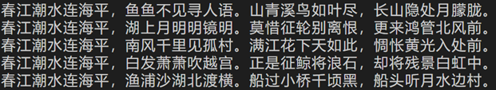
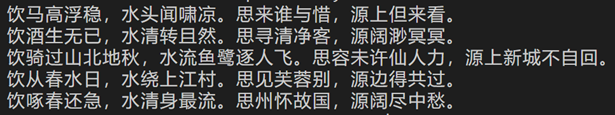
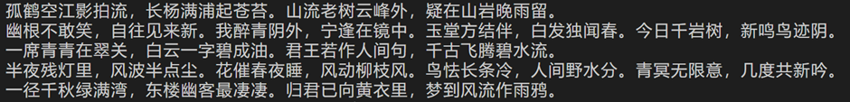


# Website
## 1.Introduction to Each Web Page
+ The Home Page  
On the homepage, we display a random quote in the center of the screen, switching every five seconds, accompanied by the dynamic effect of cherry blossoms falling. In the tab in the upper right corner, you can jump to the poetry overview page, poet overview page, quote page, visualization page, and AI poetry writing page respectively; And on the far right is the search box, which can be searched according to different needs (search for poem, content, poet, subject).  
+ The Poetry Overview Page  
  On the poetry overview page, at the top is a three-column tab where you can select poems by different dynasties, different genres, and different poets. In the center of the screen is a stack of ten cards with the main content of a poem on the card. The title, dynasty, author, and subject matter of the poem can all be clicked on and will jump to the corresponding page.Clicking on the edge of the card will switch poems. At the bottom is the button for pagination.
+ The Poet Overview Page  
On the poets overview page, you can select poets from different dynasties in the tabs above. The main page is the photos and names of the ten poets, when you hover over the picture, the poet's brief description will be displayed on the picture, and clicking on it will jump to the poet's detailed introduction page. At the bottom is the button for pagination.
+ The Detail Page  
In the poem details page, the poet's introduction, text, notes and translation, appreciation and subject matter of the poem are presented in five columns.  
In the poet's detail page, the poet's introduction, creative style statistics chart, and specific introduction are presented respectively.
+ The Quote Page  
In the quote page, ten quotes and their sources are presented from top to bottom, and there is a landscape painting next to the sentence, and the landscape painting will be lit up when the mouse hovers over the sentence.
+ The Visualization Page  
The visualization page shows a variety of graphs we have made, including statistical charts (such as high-prolific poets chart, the number of poets of a certain dynasty and the total number of poetry graphs, popular word brand fan charts, high-prolific poets and high-frequency imagery word cloud charts), subject matter relationship network diagram, poet origin distribution map, theme and creative volume heat map.
+ The Searching Result Page  
On the search results page, the returned results are presented in four columns, followed by the poem title containing keywords, the poem body containing keywords, poet search results, and theme search results.
+ The AI Writing Page  
Similar to the homepage, a poem created by AI is randomly generated in the center of the screen. In addition, AI can also complete the input sentences, or create hidden poems on the input phrases.

## 2.Difficulties We Met

### (1) Writing of Front-end Code
Since none of the students in our group had been exposed to front-end and back-end development before, it took a lot of time and effort to learn this knowledge. After a long period of debugging and modification, we finally wrote the HTML file of the homepage with CSS styles and JavaScript dynamic effects, which are shown below:  
#### **HTML**:  
```html
    <!DOCTYPE html>
    <html lang="zh-cn">
    <head>
        <meta charset="UTF-8" />
        <meta name="viewport" content="width=device-width, initial-scale=1, shrink-to-fit=no" />
        <meta http-equiv="x-ua-compatible" content="ie=edge" />
        <title>寻章</title>
        <!-- Font Awesome -->
        <link rel="stylesheet" href="https://use.fontawesome.com/releases/v5.11.2/css/all.css" />
        <!-- Google Fonts Roboto -->
        <link rel="stylesheet" href="https://fonts.googleapis.com/css2?family=Roboto:wght@300;400;500;700&display=swap" />
        <!-- MDB -->
        <link rel="stylesheet" href="/static/css/mdb.min.css" />
        <!-- bounce -->
        <link rel="stylesheet" href="https://cdnjs.cloudflare.com/ajax/libs/animate.css/4.1.1/animate.min.css"/>
        <script src="/static/js/jquery.js"></script>
        <script type="text/javascript">
        $(function (){
            setInterval("play()",5000)
        })
        function play() {
            $.getJSON('/data').done(function (data){
            varse=data["random_varse"][0];
            varse_source=data["random_varse"][1]
            })
            document.getElementById("famous_verse_content").innerHTML = varse;
            document.getElementById("famous_verse_source").innerHTML = varse_source;
            requestAnimationFrame((time) => {
            requestAnimationFrame((time) => {
                document.getElementById("verse").className = "lead animate__animated animate__bounce";
            });
            });
            document.getElementById("verse").className="lead animate__animated";
        }
        </script>
    </head>
    <body>
        <!--Main Navigation-->
        <style>
        #intro {
            background-image: url("../static/featue-bg.jpg");
            height: 100vh;
        }
        /* Height for devices larger than 576px */
        @media (min-width: 992px) {
            #intro {
            margin-top: -58.59px;
            }
        }
        .navbar .nav-link {
            color: rgb(1, 0, 0) !important;
        }
        </style>
        <!-- Navbar-->
        <nav class="navbar navbar-expand-lg" style="z-index: 2000;">
        <div class="container-fluid justify-content-between">
            <!-- Left elements -->
            <div class="d-flex">
            <!-- Brand -->
            <a class="navbar-brand nav-link">
                <strong>寻章</strong>
            </a>
            </div>
            <!-- Left elements -->

            <!-- Right elements -->
            <ul class="navbar-nav ms-auto">
            <a class="navbar-brand nav-link" href="./">首页</a>
            <a class="navbar-brand nav-link" href="./poetry">诗文</a>
            <a class="navbar-brand nav-link" href="./varses/page=1">名句</a>
            <!-- <a class="navbar-brand nav-link" href="./author?dynasty=唐代&page=1" >作者</a> -->
            <a class="navbar-brand nav-link" href="./author/dynasty=不限/page=1" >作者</a>
            <a class="navbar-brand nav-link" href="./AIPoetry" >AI创作</a>
            <a class="navbar-brand nav-link" href="./graph/data" >可视化</a>
            </ul>
            <!-- Search form -->
            <form class="input-group w-auto my-auto d-none d-sm-flex" action="result/content=name/page=1">
            <input
                autocomplete="off"
                type="search"
                class="form-control rounded"
                placeholder="在此搜索"
                style="min-width: 125px;"
                name="keyword"                
            />
            <button id="search-button" type="search" class="btn btn-primary">
                <i class="fas fa-search"></i>
            </button>
            </form>
            <!-- Right elements -->
        </div>
        </nav>
        <!-- Navbar -->
        <div id="intro" class="bg-image shadow-2-strong animate__animated animate__fadeIn">
        <div class="mask" >
            <div class="container d-flex align-items-center justify-content-center text-center h-100">
            <div class="container py-5 h-100">
                <div class="row d-flex justify-content-center align-items-center h-100">
                <div class="col col-lg-9 col-xl-7">
                    <div class="card" style="border-radius: 15px; background-color: #ffffff29;">
                    <div class="card-body p-5">                       
                        <figure class="text-center mb-0" >
                        <blockquote class="blockquote">
                            <p class="pb-3" id="verse">
                            <span  id="famous_verse_content" class="lead" style="font-size:2rem;font-family: 楷体;">热爱可抵岁月漫长！</span>
                            </p>
                        </blockquote>
                        <figcaption class="blockquote-footer mb-0" style="font-size:1rem;">
                            <span  id="famous_verse_source">电工B第三小组</span>
                        </figcaption>
                        </figure>           
                    </div>
                    </div>
                </div>
                </div>
            </div>
            </div>
        </div>
    </body>
    <script src="../static/js/yinhua.js"></script>
    </html>
```
In order to improve efficiency and better complete big jobs, we make full use of the resources in some front-end open source websites to see the code written by excellent front-end developers, which also helps us understand the front-end and accumulate development experience. For example, we borrowed from card flipping, dynamic effects of images changing from black and white to color, and so on. Some of the CSS and JavaScript code is shown below:
#### **CSS**(cards):  
```css
    .card {
        position: absolute;
        top: 0;
        left: 0;
        z-index: 2;
        background: #f9f1db;
        border-radius: 30px;
        padding: 40px;
        box-shadow: 0 0 40px #d1c2d3;
        transform: translateY(0) rotate(4deg) translateX(25px) scale(1);
        transform-origin: 0 0;
        transition: transform 0.6s cubic-bezier(.8, .2, .1, 0.8) 0.1s, background 0.4s linear;
        cursor: pointer;
        user-select: none;
    }
    @keyframes card-out {
        0% {
        z-index: 20;
        transform: translateY(0px) rotate(-4deg);
        }
        50% {
        transform: translateY(-120%) rotate(-5deg) translateX(-40px);
        }
        80% {
        z-index: 1;
        }
        100% {
        transform: translateY(-50px) rotate(8deg) translateX(55px) scale(0.95);
        }
    }
    .card--current {
        cursor: auto;
        user-select: auto;
        position: relative;
        z-index: 10;
        opacity: 1;
        background: #f9e8d0;
        transform: rotate(-1deg) translateX(0%) scale(1);
    }
```
#### **JavaScript**(picture turns color):
```JavaScript
    const setTweenArea = (link, magicArea) => {
    const { left, height, top, width } = getAreaDetails(link);
    gsap.set(magicArea, {
        top,
        left,
        width,
        height
    });
    };

    const tweenMagicArea = (target, magicArea) => {
    const { left, height, top, width } = getAreaDetails(target);

    gsap.to(magicArea, 0.5, {
        left,
        top,
        width,
        height,
        ease: Power3.easeInOut
    });
    };
    links.map((link) => {
        link.addEventListener("mouseenter", function (e) {
        tweenMagicArea(e.target, magicArea);
        });

        link.addEventListener("focus", function (e) {
        tweenMagicArea(e.target, magicArea);
        });

        if (isTweenBack && magicActiveElement.length) {
        link.addEventListener("mouseleave", function (e) {
            tweenMagicArea(magicActiveElement[0], magicArea);
        });

        link.addEventListener("focusout", function (e) {
            tweenMagicArea(magicActiveElement[0], magicArea);
        });
        }
    });
    };

    const initMagic = ({ isResize } = { isResize: false }) => {
    if (!magicAreas.length) return;

    magicAreas.map((magicArea) => {
        const targetMagicArea = magicArea.getAttribute("data-target-class");

        const links = [...document.querySelectorAll(targetMagicArea)];

        if (!links.length) return;

        setMagic(links, magicArea);

        if (!isResize) {
        const isTweenBack = magicArea.getAttribute("data-tween-back") === "true";

        moveMagicArea(links, magicArea, isTweenBack);
        }
    });
    };
```
It is worth noting that the GSAP library is used in JavaScript where images change from black and white to color, which can animate everything JavaScript can manipulate (CSS properties, SVG, React, canvas, common objects, etc.), while solving compatibility problems that exist on different browsers, and is extremely fast (20 times faster than jQuery).  
Although these ready-made resources were utilized, it was not easy to connect perfectly in our project. On the one hand, many html tags need to be corrected to correspond to our web pages; On the other hand, CSS code between different plugins may have duplicate names, and direct introduction can cause a mess. Therefore, after introducing these codes, we still carried out a lot of debugging and modification, as well as details processing, etc., to complete the task of front-end development.


### (2) Integration of Individual Modules

Due to the division of labor in small groups, the initial work was carried out independently. When the respective tasks are completed, it is difficult to merge. For the introduction of the visualization module, it is necessary to introduce script tags in the HTML file and write back-end code to complete the dynamic acquisition of data (for example, different poets, data should be obtained immediately when drawing statistical charts); In addition, the results returned by the search engine are also processed on the backend before being sent to the frontend.  
Below is the front-end and back-end code in the poet's details page, which loads data asynchronously:
#### **HTML**(poet_detail.html):
```html
    <script type="text/javascript">
        $.getJSON('/data2/{{ name }}').done(function(data) {
            // 填入数据
            myChart.setOption({
                
                series: [
                {
                    // 根据名字对应到相应的系列
                    
                    data: data.data
                }
                ]
            });
            });
    </script>
```
#### **python**(main.py):
```python
    @app.route("/data2/<name>",methods = ['GET'])
    def get_data2(name):
        return json.dumps(get_graph_data(name))
```
#### **python**(query.py):
```python
    def get_graph_data(name):
        conn = pymysql.connect( host='127.0.0.1',
                            port=3306,
                            user='root',
                            passwd='root',
                            db='chinesepoetry',
                            charset="utf8")

        cursor = conn.cursor()
        cursor.execute(''' select style from poets_table where poet = %s ''',name)
        style = cursor.fetchone()
        style = style[0]
        style = style.split('/')
        style_list = []
        sum_list = []


        style_dic = {}
        for one in style:
            index = one.find(':')
            if index == -1:
                break
            style_dic[one[0:index]] = int(one[index + 1:])
            
        style_dic = sorted(style_dic.items(),key = lambda x:x[1],reverse = True)
        if len(style_dic) > 10:
            style_dic = style_dic[0:10]
        for one in style_dic:
            style_list.append(one[0])
            sum_list.append(one[1])
        ans_dic = {}
        ans_dic['style'] = style_list
        ans_dic['sum'] = sum_list
        

        data_list = []

        length = len(ans_dic['style'])

        for i in range(length):
            data_dic = {}
            data_dic['value'] = ans_dic['sum'][i]
            data_dic['name'] = ans_dic['style'][i]
            data_list.append(data_dic)
        
        final_dic = {}
        final_dic['data'] = data_list

        return final_dic
```
It can be seen that the implementation of these functions is inseparable from the basic operation of Python and the use of MySQL database.
### (3) The Order of Poems Presented
Another problem encountered during development was the order in which the poems were displayed on the poem detail page. Due to the asynchronous crawler, the crawling order of 34w poems is chaotic, resulting in the popularity information of different poems cannot be obtained. Fortunately, because the number of poets is small and the speed of sequential crawling is faster, we can rank the popularity of all poets. Then we find that most of the poems are not translated and commentary, and there is no introduction to the subject matter, so these poems can be considered low in popularity, so there are three more measures of popularity. Based on the above considerations, we weighted each poem, the criteria were the popularity of the poet, the order in which the poem appeared in all the poet's poems, whether there was annotated translation, whether there was appreciation, and whether there was a theme introduction, and comprehensively determined its popularity (these five aspects should be normalized).  
Assume $x_1$~$x_2$ each represents the above five scoring indicators,then we have:  
$$
x_1=\frac{poetID_{max}-poetID_x}{poetID_{max}-poetID_{min}}
$$


$$
x_2=\frac{poemID_{max}-poemID_x}{poemID_{max}-poemID_{min}}
$$


$$
x_3=\left\{
\begin{aligned}
1 \quad ,if\ the\ poem\ has\ translation \\
0 \quad \quad\quad\quad\quad  ,otherwise\quad\quad\quad\quad
\end{aligned}
\right.
$$

$$
x_4=\left\{
\begin{aligned}
1 \quad ,if\ the\ poem\ has\ appreciation \\
0 \quad \quad\quad\quad\quad\quad  ,otherwise\quad\quad\quad\
\end{aligned}
\right.
$$

$$
x_5=\left\{
\begin{aligned}
1 \quad ,if\ the\ poem\ has\ subject \\
0 \quad \quad\quad  ,otherwise\quad\quad\quad\
\end{aligned}
\right.
$$
Then the final_score is given by(we suppose the five weight are the same):
$$
final\_score=\frac{\sum_{i=0}^5x_i}{5}
$$

## 3.Some Web Images 


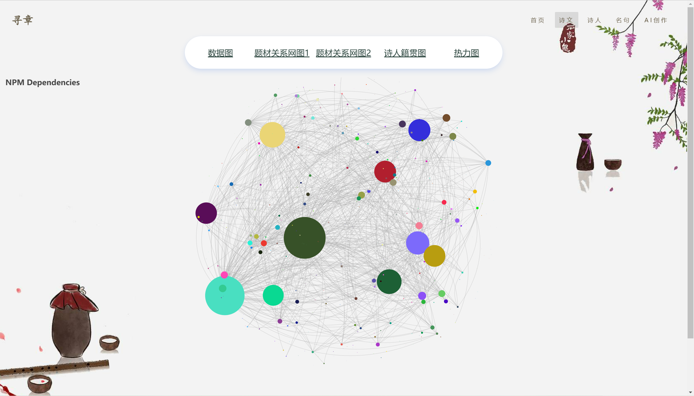

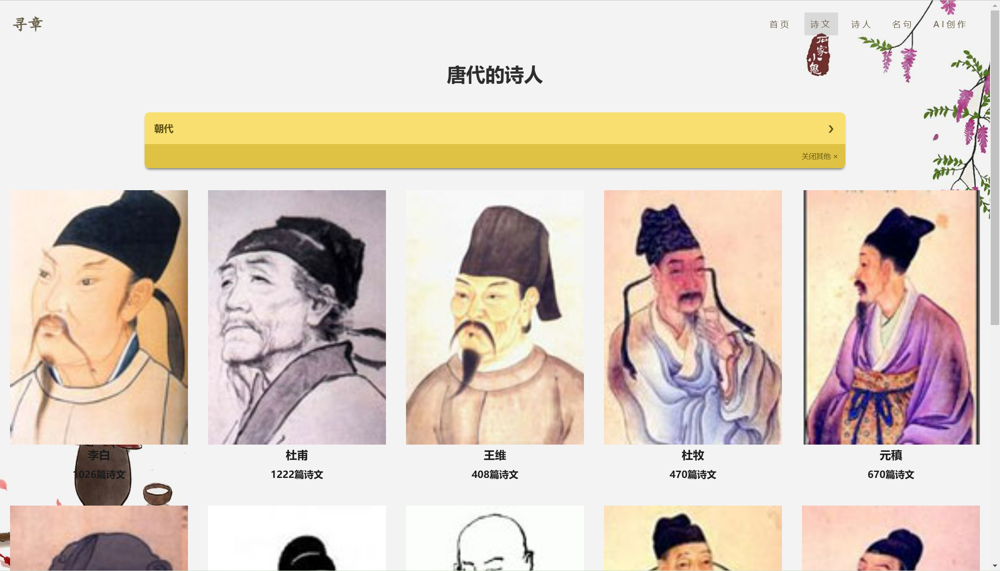


# Visualization  
## Data Charts

&ensp;&ensp;In the generation of visual images, the early processing of data is an extremely important part, which is directly related to the overall post-display effect, so as to better make users intuitively and accurately understand the relationship network between the relevant data situation and elements. 

&ensp;&ensp;Our visual images are divided into three plates: ——Echarts graphics modules, Gephi network module and Wordcloud word cloud module, which show the quantitative relationship of poets' poems and complete the classification of common images.  

&ensp;&ensp;With echarts, we can easily complete this work


### **Tools Used**  
```html
	<script src="/static/js/echarts.js"></script>
    <script src="/static/js/jquery.js"></script>
    <script src="/static/js/china.js"></script>
    <script src="https://cdn.bootcss.com/wordcloud2.js/1.1.0/wordcloud2.js"></script>
```


&ensp;&ensp;The third one is used for the wordcloud picture.

### **Data Acquisiton**

&ensp;&ensp;All the data come from our crawler and database.  

&ensp;&ensp;Through two ways,we can let the charts get the data.

**1.put the data in the charts(direct access)**  

like this:  
`series:[...  
data=[61,42,145,189,213,245]  
...]`

**2.put the data in the main.cpp(Asynchronous access)**  
&ensp;&ensp;It is more convenient to change the data through this way.  
&ensp;&ensp;The detailed implementation process can be seen in the back-end section introduction.

### **Layout**
&ensp;&ensp;The pictures are put on the website side by side.  

```html
<div id="main1" style="width:1600px;height: 600px;">
        <div id="left" style="width:800px;height: 600px;float:left;"></div>
        
        <div id="right" style="width:800px;height: 600px;float:left;"></div>
        
 </div>
  
```

### **The Pictures**  


#### 1.**Echarts images**  
&ensp;&ensp;We used echarts to make pie chart, scatter map, 2 D plain map and other multiple images, taking the way of synchronous data acquisition.  
```html
<script type="text/javascript">
    //var myChart = echarts.init(document.getElementById('main'));

    var chartDom = document.getElementById('right2');
    var myChart = echarts.init(chartDom);
    var option;
    const data2 = [];
    for (let i = 0; i <= 100; i++) {
    let theta = (i / 100) * 360;
    let r = 5 * (1 + Math.sin((theta / 180) * Math.PI));
    data2.push([r, theta]);
    }
        option = {
          backgroundColor: '#2c343c',
          title: {
            text: '流行词牌TOP10',
            left: 'center',
            top: 20,
            textStyle: {
              color: '#ccc'
            }
          },
          tooltip: {
            trigger: 'item'
          },
          visualMap: {
            show: false,
            min: 800,//要随词牌出现个数（data-value）改变（即成比例），目测50%-200%颜色比较好看
            max: 3600,
            inRange: {
              colorLightness: [0, 1]
            }
          },
          series: [
            {
              name: 'Access From',
              type: 'pie',
              radius: '55%',
              center: ['50%', '50%'],
              data: [
                { value: 2150 ,name:' 临江仙 '} ,
               	...
              ].sort(function (a, b) {
                return a.value - b.value;
              }),
              roseType: 'radius',
              label: {
                color: 'rgba(255, 255, 255, 0.3)'
              },
              labelLine: {
                lineStyle: {
                  color: 'rgba(255, 255, 255, 0.3)'
                },
                smooth: 0.2,
                length: 10,
                length2: 20
              },
              itemStyle: {
                color: '#c23531',
                shadowBlur: 200,
                shadowColor: 'rgba(0, 0, 0, 0.5)'
              },
              animationType: 'scale',
              animationEasing: 'elasticOut',
              animationDelay: function (idx) {
                return Math.random() * 200;
              }
            }
          ]
        };
    option && myChart.setOption(option);

</script>
```
&ensp;&ensp;The picture looks like:  
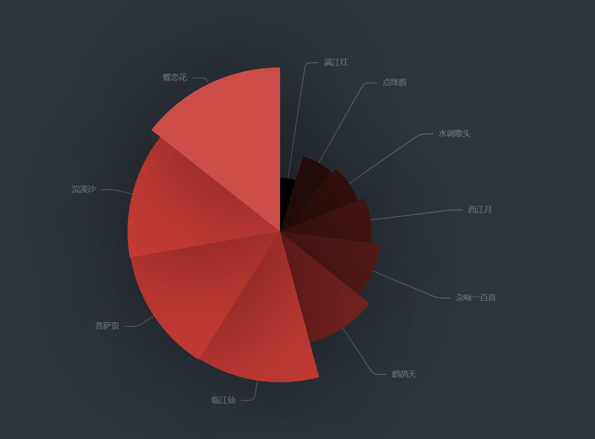

```html
<script type="text/javascript">

    var chartDom = document.getElementById('right');
    var myChart = echarts.init(chartDom);
    var option;
const data1 = [
[

[30239, 578, 4040000000, '元','平均比率'],
...


],

];
        option = {
          backgroundColor: new echarts.graphic.RadialGradient(0.3, 0.3, 0.8, [
            {
              offset: 0,
              color: '#f7f8fa'
            },
            {
              offset: 1,
              color: '#cdd0d5'
            }
          ]),
          title: {
            text: '各朝代诗人数目与诗词总量',
            left: '5%',
            top: '3%'
          },
          legend: {
            right: '10%',
            top: '3%',
            data: ['平均比率']
          },
          grid: {
            left: '8%',
            top: '10%'
          },
          xAxis: {
            splitLine: {
              lineStyle: {
                type: 'dashed'
              }
            }
          },
          yAxis: {
            splitLine: {
              lineStyle: {
                type: 'dashed'
              }
            },
            scale: true
          },
          series: [
            {
              name: '平均比率',
              data: data1[0],
              type: 'scatter',
              symbolSize: function (data) {
                return Math.sqrt(data[2]) / 7e2;
              },
              emphasis: {
                focus: 'series',
                label: {
                  show: true,
                  formatter: function (param) {
                    return param.data[3];
                  },
                  position: 'top'
                }
              },
              itemStyle: {
                shadowBlur: 10,
                shadowColor: 'rgba(120, 36, 50, 0.5)',
                shadowOffsetY: 5,
                color: new echarts.graphic.RadialGradient(0.4, 0.3, 1, [
                  {
                    offset: 0,
                    color: 'rgb(251, 118, 123)'
                  },
                  {
                    offset: 1,
                    color: 'rgb(204, 46, 72)'
                  }
                ])
              }
            },

          ]
        };

    option && myChart.setOption(option);

</script>
```

&ensp;&ensp;The picture looks like:  

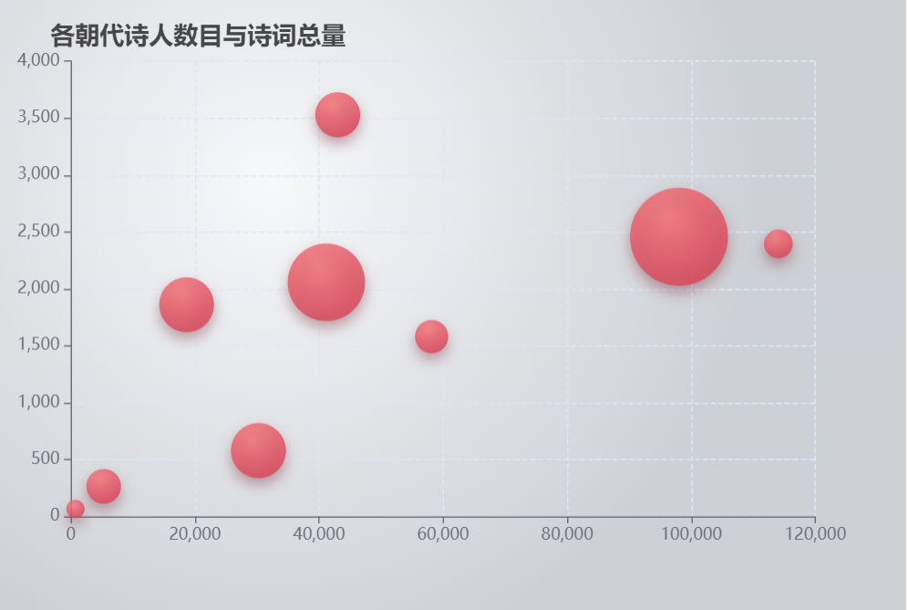  

```html
<script type="text/javascript">

            var chartDom = document.getElementById('main');
            var myChart = echarts.init(chartDom);
            var option;
                option = {
                    title: {
                        text: '诗人籍贯分布图',
                        left: 'center'
                    },
                    tooltip: {
                        trigger: 'item'
                    },
                    legend: {
                        orient: 'vertical',
                        left: 'left',
                        data: ['诗人籍贯分布图']
                    },
                    visualMap: {
                        type: 'piecewise',
                        pieces: [
                            {min: 3000, max: 1000000, label: '大于等于3000人', color: '#80101C'},
                            ...
                        ],
                        color: ['#E0022B', '#E09107', '#A3E00B']
                    },
                    toolbox: {
                        show: true,
                        orient: 'vertical',
                        left: 'right',
                        top: 'center',
                        feature: {
                            mark: {show: true},
                            dataView: {show: true, readOnly: false},
                            restore: {show: true},
                            saveAsImage: {show: true}
                        }
                    },
                    roamController: {
                        show: true,
                        left: 'right',
                        mapTypeControl: {
                            'china': true
                        }
                    },
                    series: [
                        {
                            name: '诗人数',
                            type: 'map',
                            mapType: 'china',
                            roam: false,
                            label: {
                                show: true,
                                color: 'rgb(249, 249, 249)'
                            },
                            data: [
                               {
                                  name: '北京',
                                  value: 189
                                }, ...
                            ]
                        }
                    ]
                };

            option && myChart.setOption(option);

        </script>
```


&ensp;&ensp;The picture looks like:  

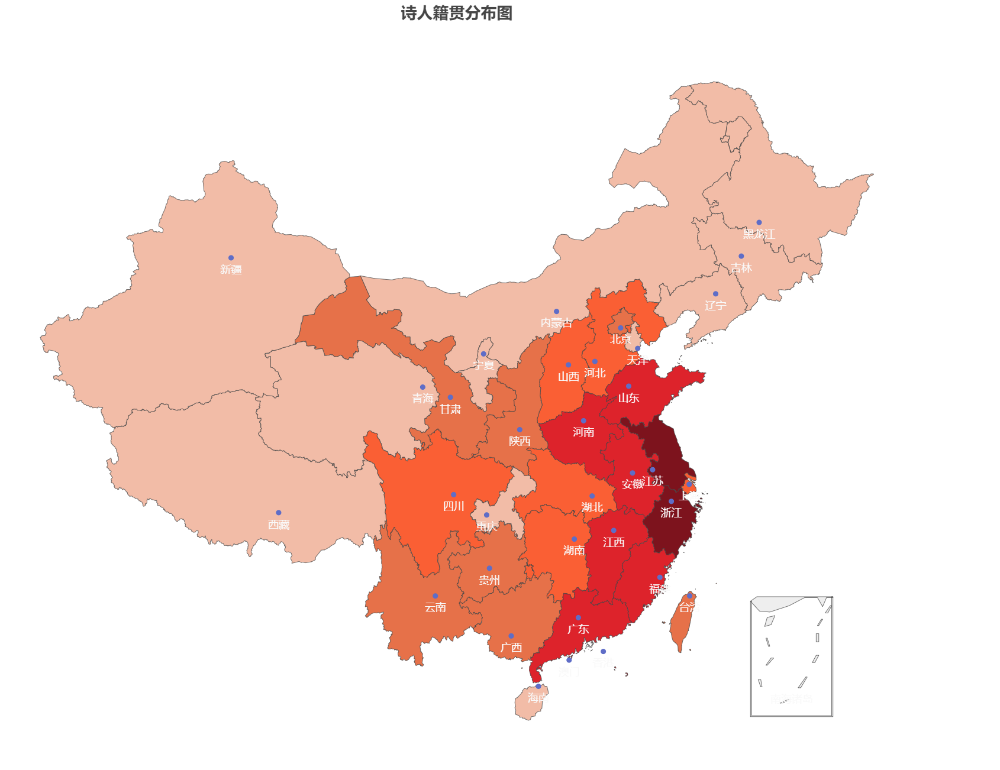  


#### 2.The Wordcloud Chart  
&ensp;&ensp;We used a new js file to provide the function to make the wordcloud chart.  
&ensp;&ensp;The chart is different from the bar charts, mainly the "series" part ,it used the color gradient function.  
&ensp;&ensp;The different part is like this:  
```python
from stylecloud import gen_stylecloud
import random
import re

# 读取数据
with open('yixiang.txt', encoding='utf-8') as f:
    data = f.read()
new_data = re.findall('[\u4e00-\u9fa5]+', data, re.S)
new_data = " ".join(new_data)
#print(new_data)

# 文本预处理  去除一些无用的字符   只提取出中文出来

#print(result_list)

# 将palettable配色方案 1587类弄到了本地txt里  读取配色方案
with open('palettable配色方案.txt') as f:
    choices = f.read().split('\n')[:-1]
#print(choices)

# 个人推荐使用的palette配色方案
# colorbrewer.qualitative.Dark2_7
# cartocolors.qualitative.Bold_5
# colorbrewer.qualitative.Set1_8

gen_stylecloud(
    text=data,               # 文本数据
    
    size=800,                                 # 词云图大小
    font_path='simhei.ttf',   # 中文词云  显示需要设置字体
    output_name='cloud2.png',                   # 输出词云图名称
    # icon_name='fas fa-map',             # 图标
    icon_name='fas fa-rocket',
    gradient='horizontal',
    palette=random.choice(choices)            # 随机选取配色方案

)
```
&ensp;&ensp;The wordcloud picture looks like this:  

  

#### 3.Gephi data relationship presentation  
**Inspiration source**  
Gephi is mainly used for the mapping of various networks and complex systems. We find from the data that there are countless links between different labels of poetry. For example, "autumn color" often corresponds to "parting" and "desolation".  

&ensp;&ensp;We captured 166 commonly used labels, formed 592 relationship lines, and adopted a modular layout to cluster the labels, intuitively reflecting the occurrence frequency of labels and the close relationship between different labels.  

**Realization idea**  
&ensp;&ensp;First, we need to establish the correlation between labels. We find the labels of each poem from the files that have been crawled, and there is a certain connection between the labels appearing in the same poem. Therefore, we set the label nodes and add directed edges between the nodes according to the relevant information. Finally, we cluster the nodes.  

**The main difficulties**  
&ensp;&ensp;Due to the huge amount of our data, we have encountered some problems in choosing the right node layout mode. Many layouts are messy and do not effectively show the relationship between the data.  

**Solution**  
In order to clearly classify, and comprehensively show the relationship between each nodes. We adopted the fruchterman Reingold algorithm, using the layout, to achieve good symmetry and local aggregation, so that the image aesthetic degree, visual degree further strengthened.
After taking this distribution algorithm, we clustered the data according to the node information of each label. The coordinate information and classification information of each node are exported as table files, and then the svg image is colored.

&ensp;&ensp;The Gephi picture looks like this:  

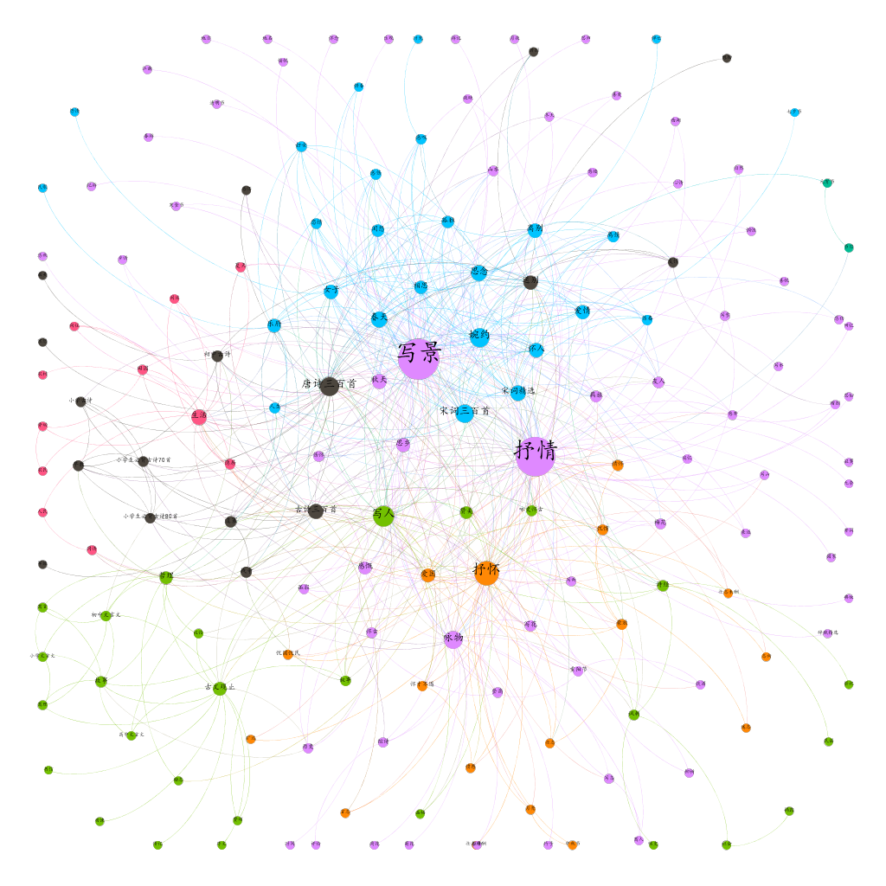  


# Data retrieval

## Elementary Functions

This project mainly uses Elasticsearch to build a search engine.

In order to better implement the word segmentation of Chinese language, modules such as the IK tokenizer under ES and the JIBA library of Python are also used.

## Import of the database

Our first step is to build an index and store the text content through the ik tokenizer - because we learned that ES's default standard tokenizer will only split Chinese into a single Chinese character, which is not in line with common Chinese usage, and will also lead to a high degree of matching when the content has the same longer vocabulary, only the word division that is more in line with Chinese usage can more accurately find the most matching results.

Codes are as follows:

```python
import json
import pymysql
from elasticsearch import Elasticsearch
es = Elasticsearch()

#Check if es is rightly connected
#print(es.ping())

#Connect with your database
conn = pymysql.connect(
    host = '127.0.0.1',
    port = 3306,
    user = 'root',
    password = 'zxcvbnm9',
    db = 'hw221127',
    charset = 'utf8'
)

cursor = conn.cursor()
mappings = {
    "mappings" : {
        "properties" : {
            "title" : {
                "type" : "text",
                "analyzer" : "ik_max_word"
            },
            "poet" : {
                "type" : "text",
                "analyzer" : "ik_max_word"
            },
            "dynasty" : {
                "type" : "text",
                "analyzer" : "ik_max_word"
            },
            "tag" : {
                "type" : "text",
                "analyzer" : "ik_max_word"
            },
            "popularity" : {
                "type" : "long",
            },
            "content" : {
                "type" : "text",
                "analyzer" : "ik_max_word"
            },
            "id" : {
                "type" : "long"
            }
        }
    }
}

#Unnotate this line if history items are to be deleted
#es.indices.delete("index_poetry")

res = es.indices.create(index = 'index_poetry',body = mappings)
sql = 'SELECT * FROM poetry_table WHERE id < 341841'
cursor.execute(sql)
result = cursor.fetchall()
for i in range(0,341840):
    es.index(
        index="index_poetry",
        id=i,
        body={
            "title":result[i][0],
            "poet":result[i][1],
            "dynasty": result[i][2],
            "tag":result[i][3],
            "popularity":result[i][4],
            "content":result[i][5],
            "id":result[i][9]
        }
    )
    #Checking process
    if i % 100 == 0:
        print(i)
print("The database is refreshed.")
```

## Search and Result Rendering

When building the search engine, we selected the direction of the search considering that the data included the title, the name of the author, the type label of the poem dynasty and the descendants in addition to the content of the poem. The final result completely relies on the powerful search function of ES, and the ordering of the results is mainly based on the matching degree calculated by ES, supplemented by the default order when crawling.

We also initially envisaged ranking by the popularity of poetry, but on the one hand, it is difficult to find a unified quantitative evaluation standard for all dynasties and authors, on the other hand, searching for content will hardly lead to the same matching score, and the default ranking of the search for authors, that is, the ranking of the original website, is basically equivalent to the popularity of poetry, that is, the current sorting method is basically feasible.

Codes are like: (Assumed that es has been connected and the preconditions are prepared)

```python

#Tags of searching, which is 'content' by default
tmp = "content"
a = int(input("Search direction (1.name, 2.author, 3.dynasty, 4.tags, 5.content) : "))
if a == 1:
    tmp = "name"
elif a == 2:
    tmp = "author"
elif a == 3:
    tmp = "dynasty"
elif a == 4:
    tmp = "tags"
elif a == 5:
    tmp = "content"
#print(tmp)

#Searching random content
b = input("Search content : ")
query = {
    "query": {
        "match": {
            tmp : b
        }
    },

    #From
    "from" : 0,
    #Size of data
    "size" : 10,

    #Sort by Popularity
    "sort": [
        {
            "_score" : {
                "order" : "desc"
            }#,
            #"popularity": {
            #    "order" : "asc"
            #}
        }
    ]
}

result = es.search(index="poetry", body=query)


t = result['hits']['hits']
for i in t:
    print(i['_source'])
```

Result instance:

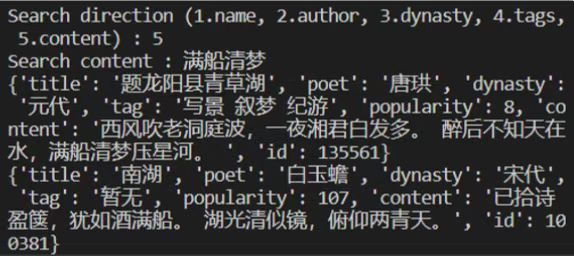

## Other attempts: Rank common intentions in ancient poetry

In practice, we have found that we can rely on word breakers to extract imagery from ancient poetry and find out which ones are more common in them. Because only word segmentation and traversal are required, and there is no need to use ES, we adopted Python's jieba library.

One ranking example:

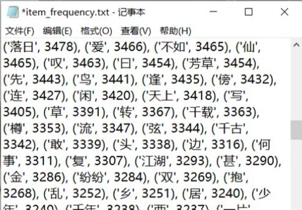


# Advantages
1.Beautiful web design. We use cards, color gradient lists, column systems to present and display poems, famous sentences, etc., which are more innovative and more attractive to people's attention than the unchanged order presentation format of the ancient poetry network
2.Rich visualizations. We have analyzed and presented the data of poets' output, the total amount of poetry, the data of each subject and the connection between them, and the image presentation, which can visually display the relevant data of the poem, which is eye-catching and more impressive.
3.Sufficient amount of data.  By using asynchronous crawlers, we take a leap in the speed at which we crawl data. Therefore, we have climbed almost all the data in the ancient poetry network, so our website has a sufficient and deep data base.
4.Powerful retrieval. Some sites may have search results that don't match what users want to search for, because the goal of the search isn't clearly set. To solve this problem, we set up four search directions. Users can check the direction they want to search to achieve precise search.


# Future Work
We still don't know enough about the AI writing poetry in our web page. What we did in this assignment was to use the 340,000 poems crawled as a training set to retrain the model and improve the creation level of the model. However, the current function is still very monotonous, and can only be created randomly, based on sentence completion, and the creation of Acrostic poems.   
Therefore, next we need to systematically learn the relevant principles of machine learning, figure out the basic methods of AI writing poetry, and on this basis, develop more literary AI and enrich AI functions, such as writing poetry according to the input keywords, creating according to the input theme, and even giving the AI the mood to create improvised poems, etc., which has a lot of room for development.  

# Duty

Data and crawler：尚功虎、齐思远  
Data retrieval：张子桓、张凯乐
Visualization：李佳航、张济昊、齐思远
Website：齐思远、尚功虎
